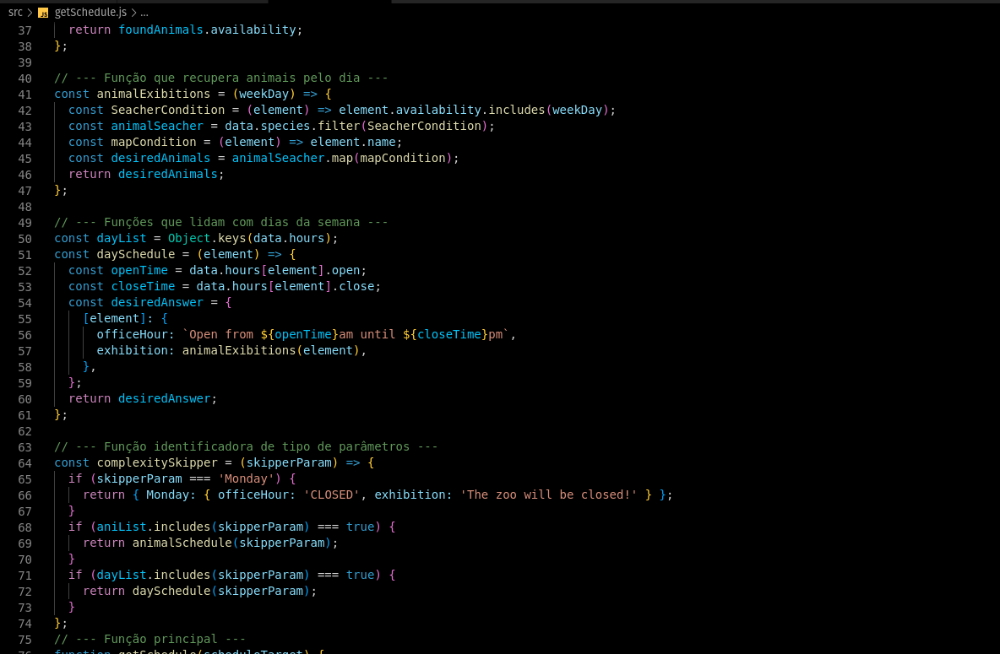

<!-- Introdução -->
<h1 align="center"> Projeto Zoo Functions  - :six: </h1>

<!-- Descrição -->
<p align="center">
Este é meu sexto projeto desenvolvido em minha jornada como desenvolvedor.
Nele desenvolvi funções diversas capazes de gerenciar diversas dados de um zoológico,
com o uso de HOFs e métodos váriados de tratamento de arrays e objetos. 
</p>

#
<!-- Habilidades -->
<h2 align="center"> Habilidades Desenvolvidas: </h2>

* Utilizei _JavaScript_ para construir funções capazes de gerenciar dados. :heavy_check_mark:
* Utilizei _High Order Functions_ para filtar, mapear, recombinar e separar elementos. :heavy_check_mark:
* Manipulei _Arrays_ para identificar, adicionar, remover e posicionar elementos. :heavy_check_mark:
* Apliquei _TDD_ para construir testes unitários que garantam a qualidade da aplicação. :heavy_check_mark:

#
<!-- Preview -->
<h2 align="center"> Preview: </h2>

<div align="center">
    
</div>

#
<!-- Ferramentas utilizadas -->
<details align="center">
  <summary>
	  <h2>Ferramentas e Tecnologias utilizadas:</h2>
	</summary>

  <div align="center">

  | Linguagens              | Tecnologias             | Frameworks              |
  | :---------------------- | :---------------------- | :---------------------- |
  | JavaScript              | HOFS                    | Jest                    |
  | .                       | .                       | .                       |

  </div>

</details>

#
<!-- Instalação e utilização -->
<details align="center">
  <summary>
    <h2>Como instalar e utilizar o projeto:</h2>
  </summary>

<details>
  <summary>
    <h3>Especificações Tecnicas:</h3>
  </summary>

  <div align="left">
  
  * Git - <i> `git -v` informará a versão em uso.</i>
  * NPM V8+ - <i> `npm -v` informará a versão em uso.</i>
  * NodeJS V16+ - <i> `node -v` informará a versão em uso.</i>

  </div>

  #

  </details>

  <div align="left">
    
  1. Faça a clonagem do projeto - <i>dependências externas também são necessárias.</i>
  ```shell
  git clone git@github.com:luanfgoncalves/project-zoo-functions.git
  ```
  2. Instale as dependencias na Raiz do projeto - <i>Não é necessário fazer `Audit Fix`</i>
  ```shell
  npm install
  ```
  3. Para executar as funções, abra os arquivos em /src - <i>É recomandado usar a extensão `Code Runner`do VScode.</i>
  > São 12 aquivos em JS, com descrições dos problemas que resolvem comentados no topo do arquivo.
  4. Para executar os testes da aplicação: - <i>Execute também na raíz do projeto.</i>
  ```
  npm test
  ```  

  </div>

</details>

#
<!-- Meu contato -->
<h2 align="center"> Conecte-se comigo: </h2>

<div align="center">
  <a href="https://instagram.com/luanfgoncalves" target="_blank"></a>
  <a href = "mailto:luanfgoncalves@outlook.com"></a>
  <a href="https://www.linkedin.com/in/luanfgoncalves/" target="_blank"></a> 
</div>
